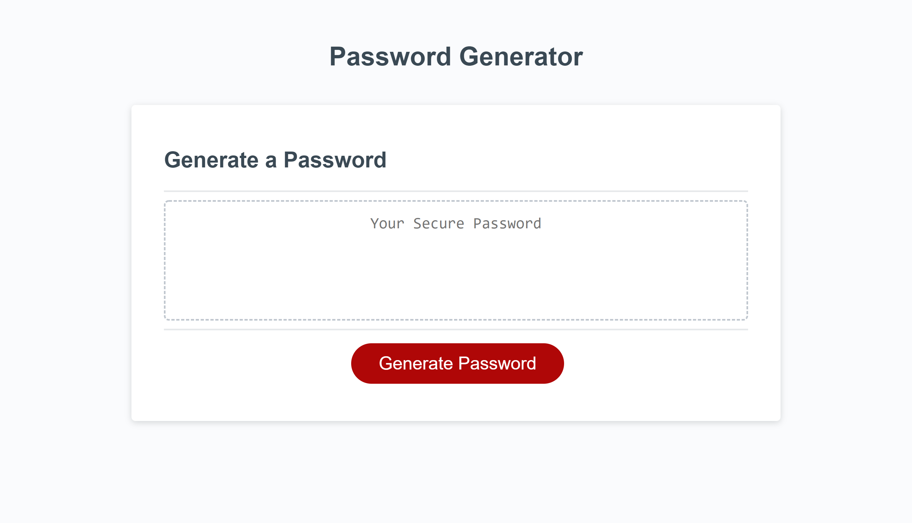

# password-generator

## Description:
Ever wanted to create a randomized password? This can help!

This generates a password from 8 to 128 characters (per user specification) and can include the following character type requirements:
- lowercase characters
- UPPERCASE CHARACTERS
- Numbers
- Special Characters

## Preview: 

## Deployed Application:
https://michaelsamm.github.io/password-generator/
